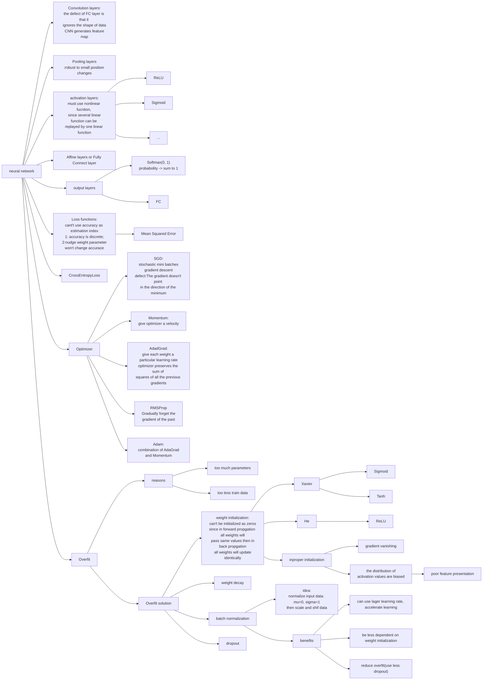

# My deep learning from scratch

## 一、简介

本项目主要使用numpy来实现一个神经网络的各个模块并且在MNIST数据集上训练，最终模型能达到99.2%的准确度。本项目不使用pytorch，tensorflow等深度学习框架，完全从头开始自己手动搭建。\
本书主要参考了《深度学习入门基于python的理论与实践》

## 二、主要文件

- ./Perceptron：实现了一些经典的逻辑电路

- ./Activate_functions：实现了一些常见的激活函数

- ./Loss_function：实现了一些常见的损失函数

- ./Output_layres：实现了一些常见的输出层

- ./Numerical_differentiation：实现了数值微分

- ./BP：用反向传播的方法实现了一些常用的层

- ./Convolutional_neural_networks：实现了卷积层、池化层

- ./Optimizers：实现了常见的优化器

- ./Overfit_solutions：实现了一些常见的解决过拟合的方法

- ./MNIST_dataset：使用MNIST数据集

- ./Common：实现了一些便于训练的类

- ./Try：一些训练代码以及对应的训练结果

- ./Try/try_nn.py：尝试了一个随机的神经网络

- ./Try/try_learning.py：训练了一个最普通的网络，使用数值微分进行训练，没有采用合适的权重初始值，网络完全学不到东西而且特别慢

- ./Try/try_learning_bp.py：在try_learning.py的基础上改成了使用反向传播进行训练，速度能加快，但还是学不到东西

- ./Try/try_learning2.py：使用了合理的超参数，训练结果在./Try/figures_21.5801/ 和 ./Try/network_files_21.5801/ 能达到88.2%的准确率

- ./Try/hyperparameter_optimization.py：搜索合适的超参数，结果在./Try/hyperparameter_optimization_figures/

- ./Try/try_cnn：使用了参考书中的代码，训练了两次。第一次采用学习率0.001，训练了20个epoch，准确率达到98.71%，结果在./Try/figures_14.8826 和 ./Try/network_files_14.8826。第二次采用学习率0.01，训练了60个epoch，准确率达到了99.2%，结果在./Try/figures_73.384 和 ./Try_network_files_73.384/

## 总结

文中的思维导图如果无法显示请先到Chrome web store 安装Github+Mermaid插件。

accuracy: 99.2%

loss: 99.2%

