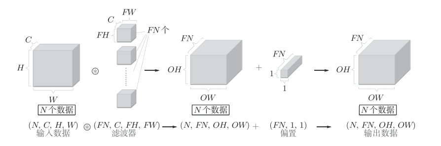
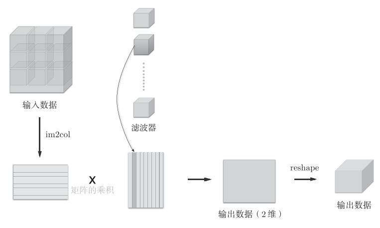
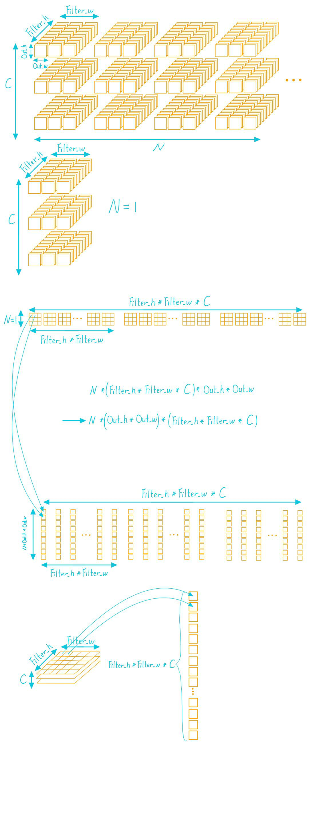
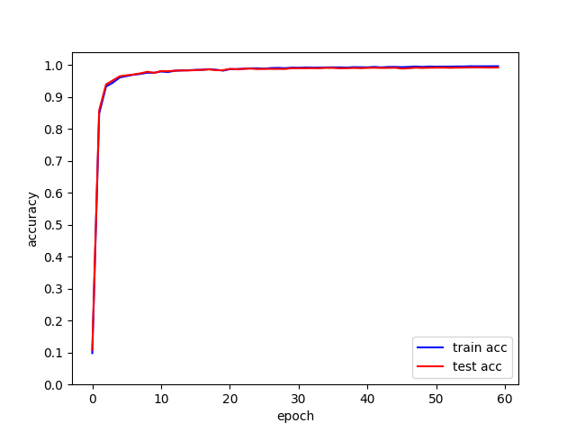
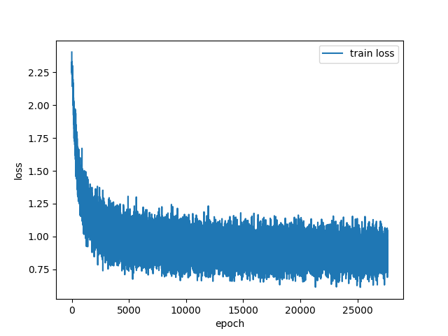
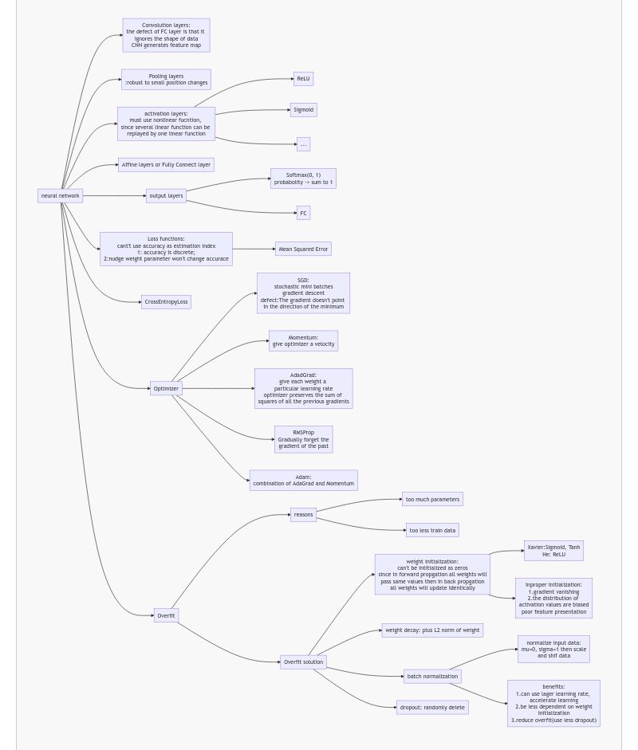

# My deep learning from scratch

## 一、简介

本项目主要使用numpy来实现一个神经网络的各个模块并且在MNIST数据集上训练，最终模型能达到99.2%的准确度。本项目不使用pytorch，tensorflow等深度学习框架，完全从头开始自己手动搭建。\
本项目主要参考了《深度学习入门基于python的理论与实践》

## 二、主要文件

- ./Perceptron：实现了一些经典的逻辑电路

- ./Activate_functions：实现了一些常见的激活函数

- ./Loss_function：实现了一些常见的损失函数

- ./Output_layres：实现了一些常见的输出层

- ./Numerical_differentiation：实现了数值微分

- ./BP：用反向传播的方法实现了一些常用的层

- ./Convolutional_neural_networks：实现了卷积层、池化层

- ./Optimizers：实现了常见的优化器

- ./Overfit_solutions：实现了一些常见的解决过拟合的方法

- ./MNIST_dataset：使用MNIST数据集

- ./Common：实现了一些便于训练的类

- ./Try：一些训练代码以及对应的训练结果

- ./Try/try_nn.py：尝试了一个随机的神经网络

- ./Try/try_learning.py：训练了一个最普通的网络，使用数值微分进行训练，没有采用合适的权重初始值，网络完全学不到东西而且特别慢

- ./Try/try_learning_bp.py：在try_learning.py的基础上改成了使用反向传播进行训练，速度能加快，但还是学不到东西

- ./Try/try_learning2.py：使用了合理的超参数，训练结果在./Try/figures_21.5801/ 和 ./Try/network_files_21.5801/ 能达到88.2%的准确率

- ./Try/hyperparameter_optimization.py：搜索合适的超参数，结果在./Try/hyperparameter_optimization_figures/

- ./Try/try_cnn：使用了参考书中的代码，训练了两次。第一次采用学习率0.001，训练了20个epoch，准确率达到98.71%，结果在./Try/figures_14.8826 和 ./Try/network_files_14.8826。第二次采用学习率0.01，训练了60个epoch，准确率达到了99.2%，结果在./Try/figures_73.384 和 ./Try_network_files_73.384/

文中的思维导图如果无法显示请先到Chrome web store 安装Github+Mermaid插件。

- ./Notes：一些笔记

## 三、关于张量(tensor)以及CNN简便运算的一些解释





```python

def im2col(input_data, filter_h, filter_w, stride=1, pad=0):
    """

    Parameters
    ----------
    input_data : 由(数据量, 通道, 高, 长)的4维数组构成的输入数据
    filter_h : 滤波器的高
    filter_w : 滤波器的长
    stride : 步幅
    pad : 填充

    Returns
    -------
    col : 2维数组
    """
    N, C, H, W = input_data.shape
    out_h = (H + 2*pad - filter_h)//stride + 1
    out_w = (W + 2*pad - filter_w)//stride + 1

    img = np.pad(input_data, [(0,0), (0,0), (pad, pad), (pad, pad)], 'constant')
    col = np.zeros((N, C, filter_h, filter_w, out_h, out_w))

    for y in range(filter_h):
        y_max = y + stride*out_h
        for x in range(filter_w):
            x_max = x + stride*out_w
            col[:, :, y, x, :, :] = img[:, :, y:y_max:stride, x:x_max:stride]

    col = col.transpose(0, 4, 5, 1, 2, 3).reshape(N*out_h*out_w, -1)
    return col

```



## 四、Accuracy and loss of the best CNN model(99.2%)

### accuracy



### loss



## 五、总结

