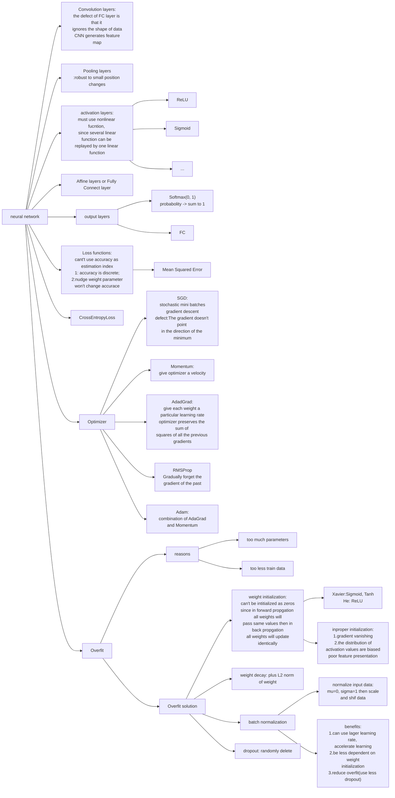

```mermaid
graph LR;
    C[neural network];

    C-->x1["Convolution layers:<br/>the defect of FC layer is that it <br/>ignores the shape of data<br/> CNN generates feature map"]

    C-->x2["Pooling layers<br/>:robust to small position changes"]

    C-->D[activation layers:<br/>must use nonlinear fucntion, <br> since several linear function can be <br/>replayed by one linear function];


    D-->D1[ReLU];

    D-->D2[Sigmoid];

    D-->D3[...];

    C-->E[Affine layers or Fully Connect layer];

    C-->F[output layers];

    F-->F1["Softmax(0, 1)<br/>probabolity -> sum to 1"];
    
    F-->F2[FC];

    C-->G["Loss functions:<br/>cant't use accuracy as estimation index<br/>1: accuracy is discrete;<br/> 2:nudge weight parameter won't change accurace"];
    
    C-->G1[CrossEntropyLoss];
    
    G-->G2[Mean Squared Error];

    C-->H[Optimizer];
    
    H-->H1["SGD:<br/>stochastic mini batches<br/>gradient descent<br/>defect:The gradient doesn't point <br/>in the direction of the minimum"];
    
    H-->H2["Momentum:<br/> give optimizer a velocity<br/>"];
    
    H-->H3["AdadGrad:<br/>give each weight a <br/>particular learning rate<br/>optimizer preserves the sum of <br/>squares of all the previous gradients"];
    
    H-->H4["RMSProp<br/>Gradually forget the<br/> gradient of the past"];
    
    H-->H5["Adam:<br/> combination of AdaGrad and Momentum"];

    C-->J[Overfit];

    J-->J1[reasons];

    J1-->J2[too much parameters];

    J1-->J3[too less train data];
    
    J-->I[Overfit solution];
    
    I-->I1["weight initialization:<br/>can't be intitialized as zeros<br/>since in forward propgation all weights will<br/> pass same values then in back propgation<br/> all weights will update identically"];
    
    I1-->I5["Xavier:Sigmoid, Tanh<br/>He: ReLU"];

    I1-->I10["inproper initialization:<br/>1.gradient vanishing<br/>2.the distribution of <br/>activation values are biased<br/>poor feature presentation"];

    I-->I2["weight decay: plus L2 norm of weight"];
    
    I-->I3[batch normalization];

    I3-->I31["normalize input data:<br/> mu=0, sigma=1" then scale<br/> and shif data];

    I3-->I32["benefits:<br/>1.can use lager learning rate, <br/>accelerate learning<br/>2.be less dependent on weight<br/>initialization<br/>3.reduce overfit(use less dropout)"];
    
    I-->I4["dropout: randomly delete"];
```